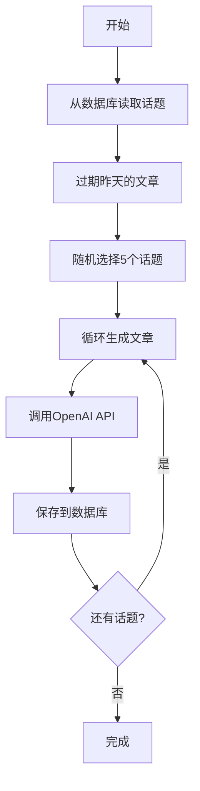

# 心态文章批量生成指南

## 概述

现在"搞好心态"功能已经改为和"历史上的今天"一样的模式：
- ✅ 提前生成好文章存储在数据库
- ✅ 前端只从数据库读取，不再实时调用API
- ✅ 文章内容不带"AI生成"等标识
- ✅ 每天定时生成新文章（通过 Netlify Scheduled Function）

## 前提条件

确保你的Supabase数据库中已经：
1. 创建了 `mindset_topics` 表
2. 创建了 `mindset_articles` 表
3. 在 `mindset_topics` 表中添加了至少5个话题

如果还没有，请先运行：
- `sql/mindset_schema.sql`
- `sql/mindset_initial_data.sql`

## 生成文章的三种方式

### 方式1：本地运行脚本（推荐）

```bash
# 1. 确保环境变量已配置
export SUPABASE_URL="your-supabase-url"
export SUPABASE_ANON_KEY="your-anon-key"
export OPENAI_API_KEY="your-openai-key"

# 2. 运行生成脚本
npm run generate:mindset

# 或者直接运行
node scripts/generate-mindset-articles.js
```

这会：
1. 从数据库读取所有激活的话题
2. 随机选择5个话题
3. 为每个话题调用OpenAI生成文章
4. 将文章保存到数据库
5. 标记昨天的文章为"已过期"

### 方式2：Netlify Scheduled Function

Netlify会每天自动运行定时任务（在 `.netlify/functions/daily-mindset-generation.js`）。

这个function会：
- 每天UTC时间 00:00 自动执行
- 生成今天的5篇新文章
- 过期昨天的文章

### 方式3：手动触发Netlify Function

在生产环境中手动触发：
```bash
# 使用curl调用Netlify Function
curl -X POST https://your-site.netlify.app/.netlify/functions/daily-mindset-generation
```

## package.json 脚本

在 `package.json` 中已经配置了：

```json
{
  "scripts": {
    "generate:mindset": "node scripts/generate-mindset-articles.js"
  }
}
```

## 脚本工作流程



## 文章生成参数

- **数量**: 每天生成5篇
- **模型**: gpt-4o-mini
- **字数**: 280-350字
- **语气**: 温柔、共情、接纳为主
- **特点**: 不带"AI生成"等标识

## 数据库结构

### mindset_articles 表字段

- `id`: UUID 主键
- `topic_id`: 话题ID（外键）
- `content`: 文章内容
- `generation_date`: 生成日期
- `is_expired`: 是否已过期
- `is_read`: 是否已被用户阅读
- `display_order`: 显示顺序（1-5）

## 前端行为

用户访问"搞好心态"页面时：
1. 从数据库查询今天生成的、未读的、未过期的文章
2. 按 `display_order` 排序，取第一篇显示
3. 用户点击"换一篇"时，标记当前文章为"已读"，加载下一篇未读文章
4. 如果没有未读文章了，显示"暂无更多文章"提示

## 常见问题

### Q: 如何添加新的话题？

直接在Supabase的 `mindset_topics` 表中插入新记录：

```sql
INSERT INTO mindset_topics (title, description, background_context, is_active, display_order)
VALUES (
  '新话题标题',
  '简短描述',
  '详细背景信息，用于AI生成文章',
  true,
  10
);
```

### Q: 如何手动生成今天的文章？

```bash
npm run generate:mindset
```

### Q: 生成失败怎么办？

检查：
1. 环境变量是否正确配置
2. OpenAI API Key是否有效且有余额
3. Supabase连接是否正常
4. 是否有至少5个激活的话题

### Q: 如何查看今天生成了哪些文章？

在Supabase Dashboard中：
```sql
SELECT * FROM mindset_articles
WHERE generation_date = CURRENT_DATE
ORDER BY display_order;
```

### Q: 文章会自动过期吗？

是的，脚本运行时会自动将昨天的文章标记为 `is_expired = true`。

## 成本估算

使用 gpt-4o-mini：
- 每篇文章约300字 → 约150 tokens
- 每天生成5篇 → 约750 tokens
- 每月约 22,500 tokens
- 成本：约 $0.01/月（非常便宜）

## 下一步

1. 运行 `npm run generate:mindset` 生成今天的文章
2. 访问网站测试"搞好心态"功能
3. 确认Netlify定时任务正常运行

---

💚 让🐻每天都能收到温暖的文章
